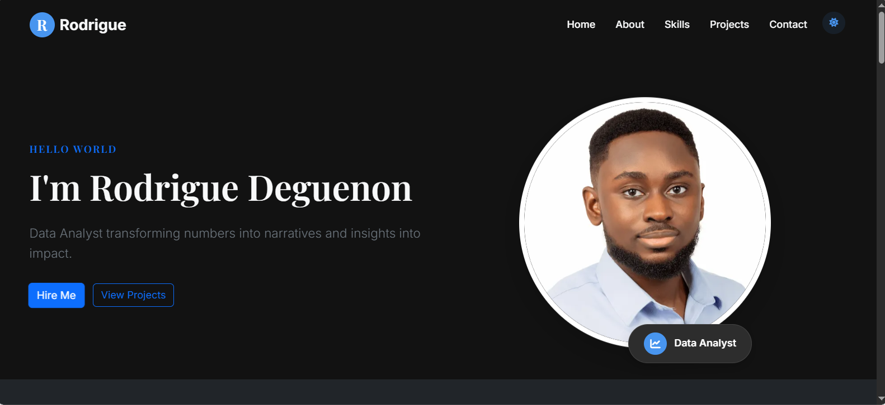

# Rodrigue Deguenon — Data Analysis Portfolio

Welcome! This portfolio highlights my expertise in data cleaning, exploration, visualization, and storytelling. Here you'll find case studies, dashboards, and reports that demonstrate my ability to turn raw data into actionable insights.

---

## 🚀 Summary

- **Data Analyst** with a business background and a passion for transforming data into value.
- Skilled in **R, SQL, Tableau, Excel, and web technologies**.
- Experienced in end-to-end analytics: from data wrangling to stakeholder-ready presentations.
- Open to new opportunities and collaborations.

---

## 🌟 Portfolio Highlights

### Furniture Sales Analysis

- **Goal:** Uncover sales trends and growth opportunities for a furniture retailer.
- **Approach:** Cleaned and analyzed sales data, identified top products, customer segments, and seasonal patterns. Delivered actionable insights and visualizations.
- **Tech:** Excel, Power Query, Pivot Tables  
  [Dashboard](https://1drv.ms/x/c/67671d55fee3b341/ERE_h7DobQdOuV233ME37EYB1QpP0gYoMQqjqmyLswiblw) | [Report PDF](https://github.com/zachrodrigue/zachrodrigue.github.io/blob/main/documents/reports/Furniture%20Sales%20Analysis%20Report.pdf)

---

### Bellabeat Fitness Data Analysis

- **Goal:** Inform product strategy by analyzing non-Bellabeat device usage.
- **Approach:** EDA on user activity, actionable recommendations, R Markdown report.
- **Tech:** R, ggplot2, tidyverse  
  [View on Kaggle](https://www.kaggle.com/code/rodriguedeguenon/capstone-project-bellabeat) | [Report PDF](./documents/reports/bellabeat-report.pdf)

---

### Cyclistic Bike Share Analysis

- **Goal:** Convert casual riders to annual members.
- **Approach:** Processed 3M+ records, identified user behavior, built Tableau dashboard.
- **Tech:** R, Tableau  
  [Dashboard](https://public.tableau.com/app/profile/rodrigue.deguenon/viz/CyclisticBikeShareAnalysis_17374684424790/Dashboard1) | [Report PDF](./documents/reports/cyclistic_report.pdf)

---

### Mint Classics Inventory Optimization

- **Goal:** Streamline warehouse operations.
- **Approach:** Analyzed multi-warehouse inventory, SQL optimization, redistribution plan.
- **Tech:** SQL, MySQL  
  [SQL Scripts](./documents/scripts/mint-classics/eda_script.sql) | [Report](./documents/reports/mint_classics_eda_report.pdf)

---

### Coming Soon

- Healthcare analytics case study in progress.

---

## 🛠️ Core Skills & Tools

**Data Analysis:**  
R, SQL, Excel, Google Sheets

**Visualization:**  
Power BI,Tableau, ggplot2

**Web Development:**  
HTML5, CSS3, JavaScript

**Design & Hosting:**  
Ion Icons, Google Fonts, GitHub Pages

---

## 👤 About Me

With a Bachelor's in Business Administration, I blend technical skills with business acumen to deliver insights that drive results. My approach:

- Transform raw data into clear visual narratives
- Develop reproducible, transparent analytical processes
- Communicate findings to both technical and non-technical audiences

---

## 🖼️ Portfolio Preview

  
*Explore the interactive site: [zachrodrigue.github.io](https://zachrodrigue.github.io/)*

---

## 📬 Contact

Let's connect or collaborate:

- 📩 [deguenonrodrigue@gmail.com](mailto:deguenonrodrigue@gmail.com)
- 💼 [LinkedIn](https://linkedin.com/in/rodriguezachariedeguenon)
- 📊 [Kaggle](https://www.kaggle.com/rodriguedeguenon)
- 🐙 [GitHub](https://github.com/zachrodrigue)

---

📜 **License:**  

- Content: All Rights Reserved  
- Code: Personal, non-commercial use allowed  
🔄 **Last Updated:** June 2025
